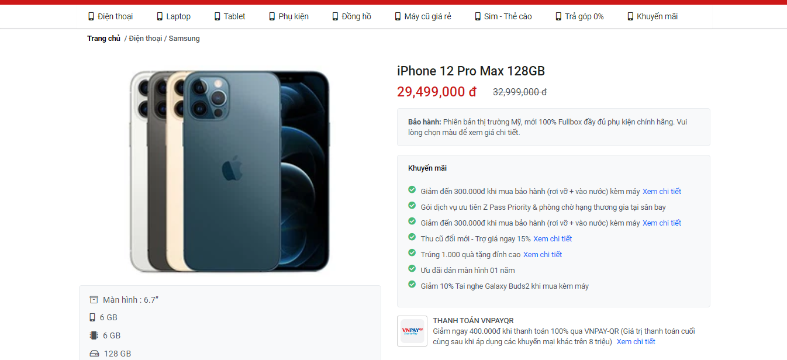
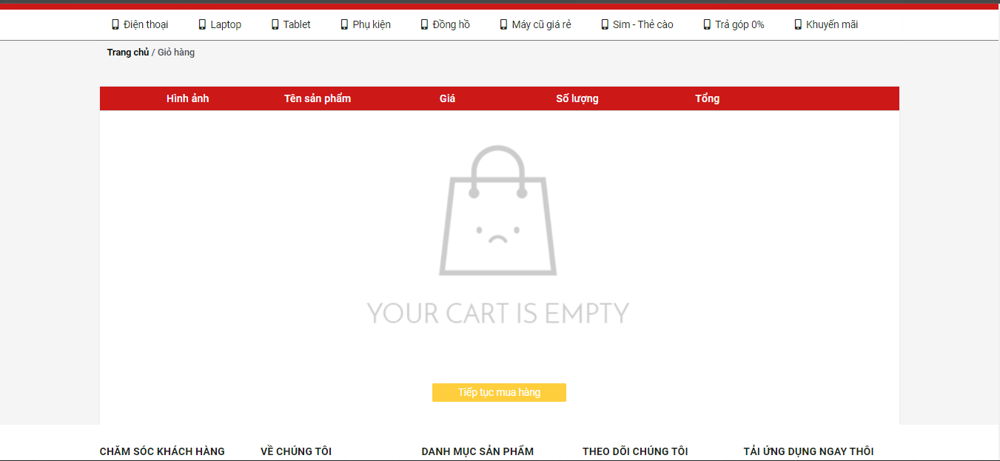
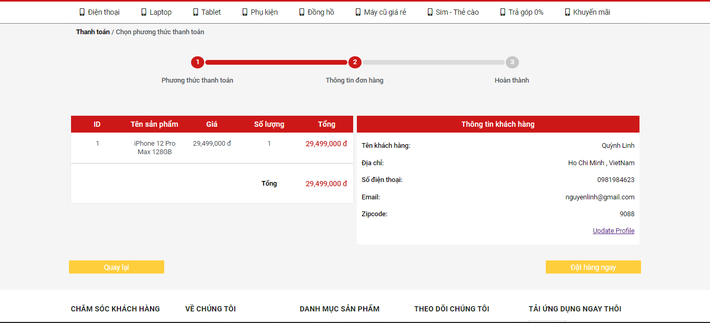

# Website Selling Electronics

## Team  Members:
```bash
Saigon University ,Faculty of Information Technology ,Major in Software Engineering
ID          | Full Name
3120410278    Nguyen Thanh Quynh Linh
```
## Project Description:
This is a website that I developed myself while learning Web Programming, the website is built with an interface based on the interface 
of the Shoppe page and built with some basic functions.
## Tech Stack Used:
```bash
FrontEnd:
    * Javascript
    * CSS
    * HTML
BackEnd:
    * PHP
Database:
    * MySql
```
## Website Functions:
For users:
```bash
* Login / registration function
* Function to add products to cart
* Product search/category function
* User function can view/edit personal information
* User function can manage orders (pending / confirmed / shipped / canceled) when admin has accepted
* User password change function
```
For admins:
```bash
* Admin can add/edit/delete products
* Admin can manage orders (confirm orders the user has placed)
* Admin can statistic the business situation of the store by month / quarter / year
* Admin can manage registered customer information
* Admin can build promotional vouchers for new users or major holidays
```
## Steps to run the website:
1. Clone from github and add to htdocs folder in xampp
2. Launch the application and go to the directory config -> config.php , change the names according to your Mysql
3. Add doanweb.sql in Database folder to Mysql
4. Then launch the website
## [Project Demo Link](https://www.youtube.com/watch?v=20o8wvX0VQw)
## Some features of the site:
Home Page                   |                   Registration Page
:---------------------------------:        |      :------------------------------:
  | 

Login Page                   |                   Description Product Page
:---------------------------------:        |      :------------------------------:
  | 

Cart Page                   |                   Order Management Page
:---------------------------------:        |      :------------------------------:
  | 
### Make sure to star the repository if you find it helpful!
<a href="https://github.com/Quynh-Linh-IT/Website-selling-electronics/stargazers"></a>
